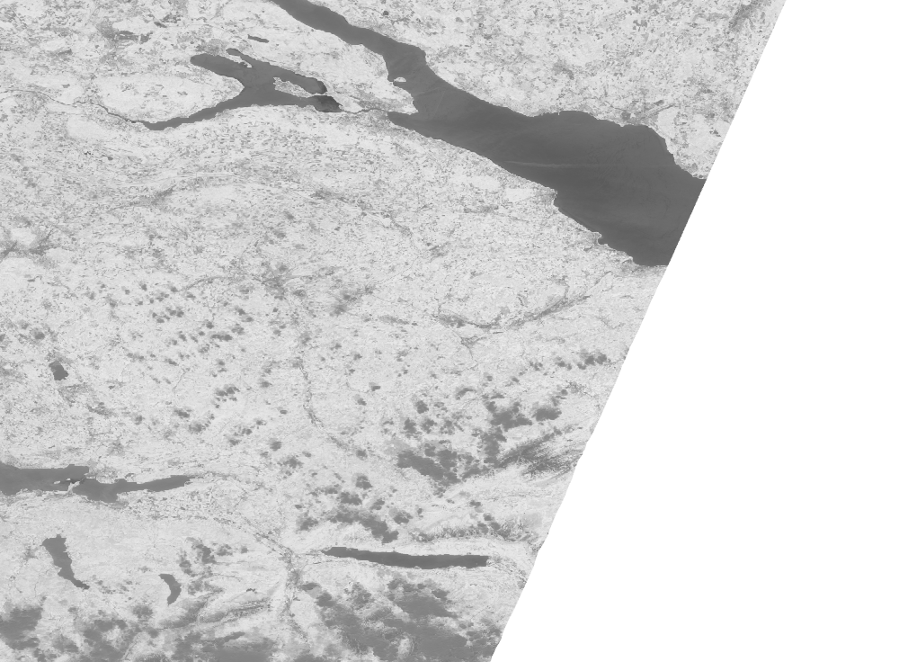
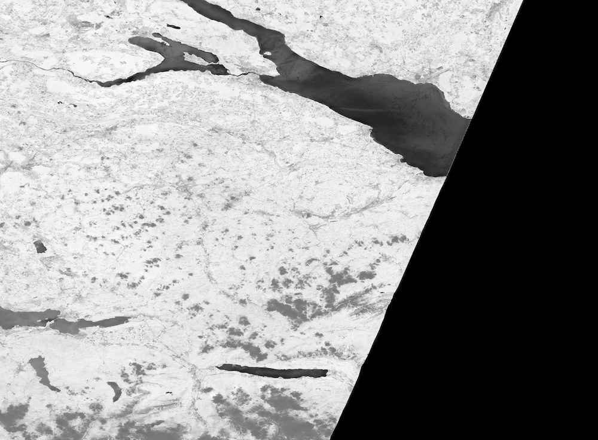
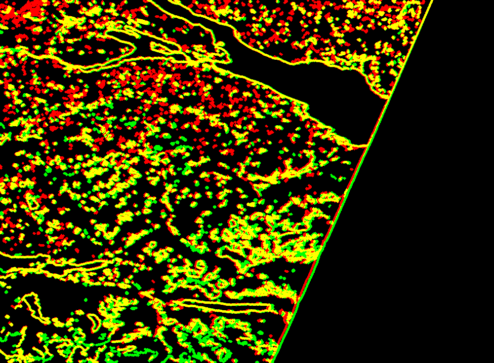
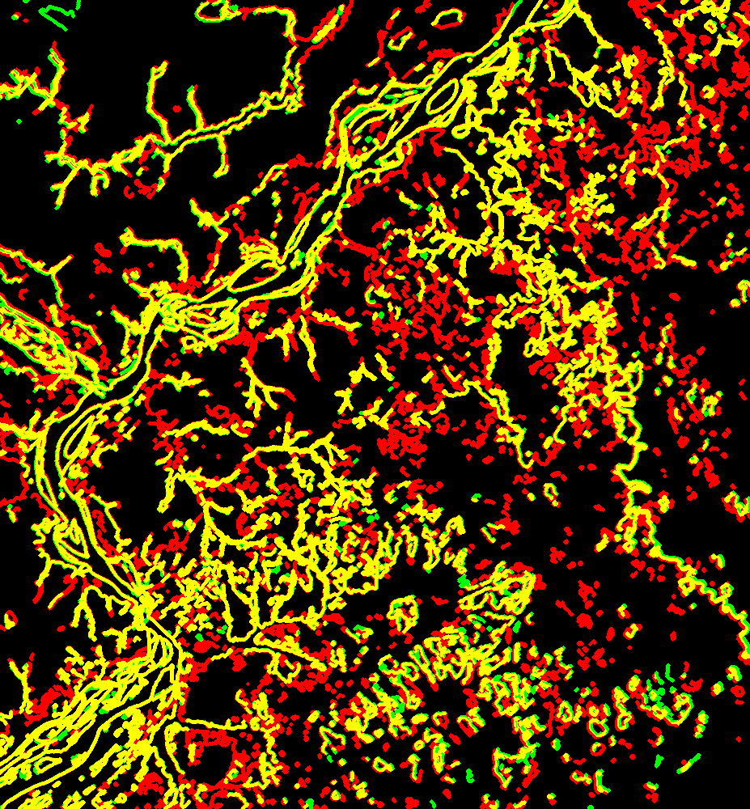

# openeo-validation-engine

There will be a proper readme soon, until then I have added some visuals :).

# Examples:

## Swiss:
### GEE: 

### EURAC (resized)

### Comparison image

Green, Red: Back-end providers. Yellow: Overlap.

## Venezuela:

### GEE: 

### EURAC (resized)

### Comparison image

Green, Red: Back-end providers. Yellow: Overlap.