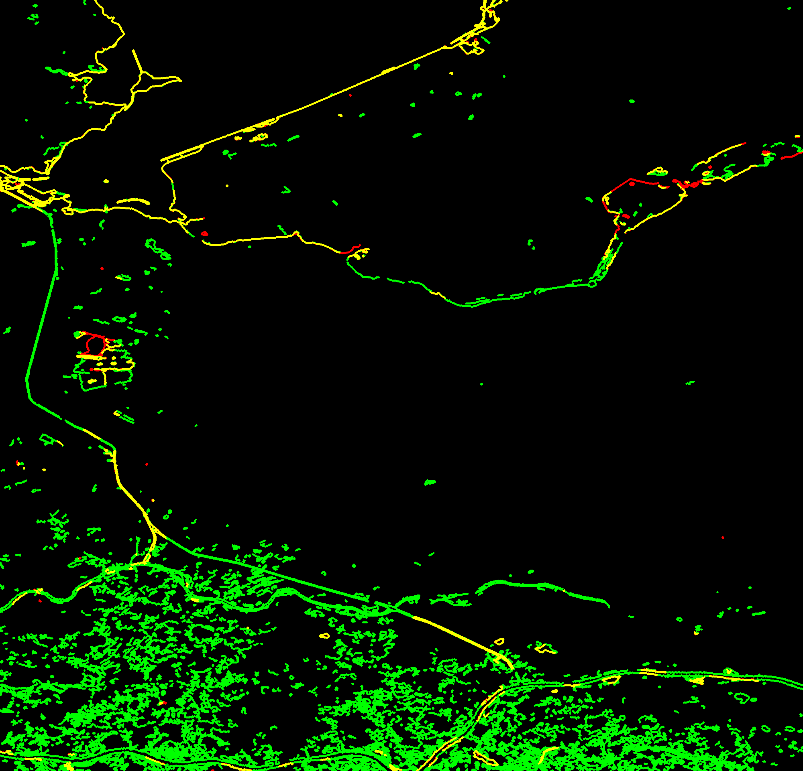
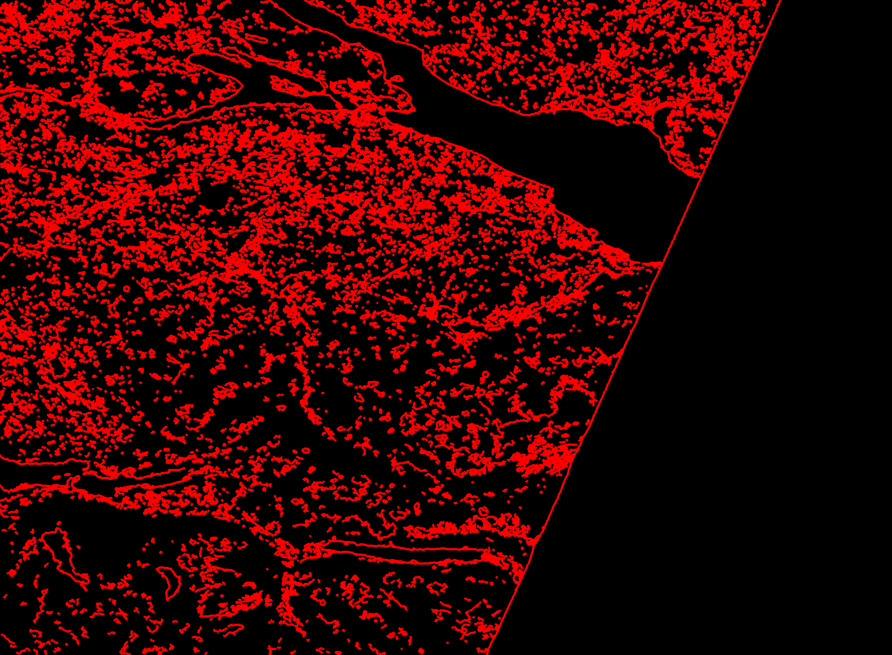

# Reports for the dataset comparison for the WWU/GEE back end

This is the comparison between using the COPERNICUS_S2 (Sentinel 2 L1C) and COPERNICUS_S2_SR (Sentinel 2 L2A) for the computation of an NDVI.

COPERNICUS_S2_SR does not contain L2A data for the Venezuela and Island jobs.

The full validation reports can be accessed in the respective folders of this branch.

## Netherlands

### Job-1

  
   

Outputs from back ends: COPERNICUS_S2 (left) COPERNICUS_S2_SR (right)

classification-checks

SSIM of pixel-checks

### Job-2

  
   

Outputs from back ends: COPERNICUS_S2 (left) COPERNICUS_S2_SR (right)

classification-checks

SSIM of pixel-checks

## Switzerland

  
   

Outputs from back ends: COPERNICUS_S2 (left) COPERNICUS_S2_SR (right)

classification-checks

SSIM of pixel-checks

## Uganda

  
   

Outputs from back ends: COPERNICUS_S2 (left) COPERNICUS_S2_SR (right)

classification-checks

SSIM of pixel-checks

## Venezuela

  
   

Outputs from back ends: COPERNICUS_S2 (left) and no output for COPERNICUS_S2_SR

classification-checks

SSIM of pixel-checks

