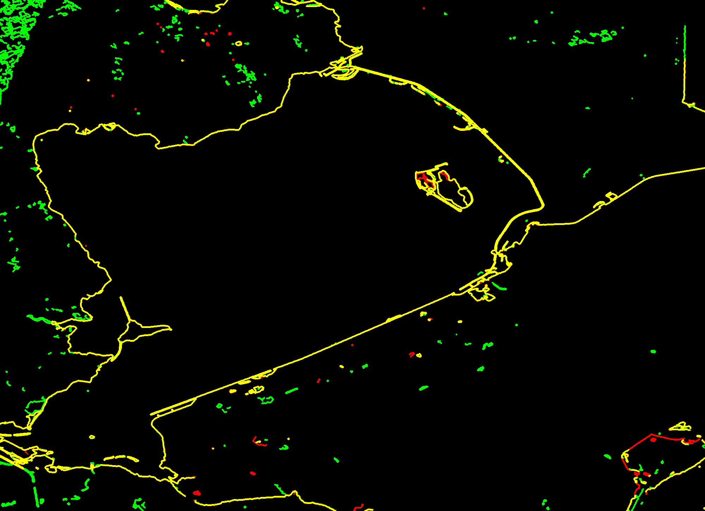
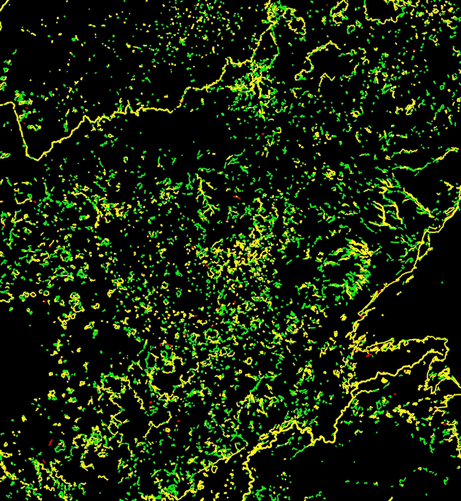

# Reports for Copernicus_S2_SR

This is the comparison between using the COPERNICUS_S2 (Sentinel 2 L1C) and COPERNICUS_S2_SR (Sentinel 2 L2A).

COPERNICUS_S2_SR does not contain L2A data for the Venezuela and Island jobs. 

## Netherlands

### Job-1

classification-checks

SSIM

### Job-2

classification-checks

SSIM

## Switzerland

classification-checks

SSIM

## Uganda

classification-checks

SSIM

## Venezuela

classification-checks

SSIM
